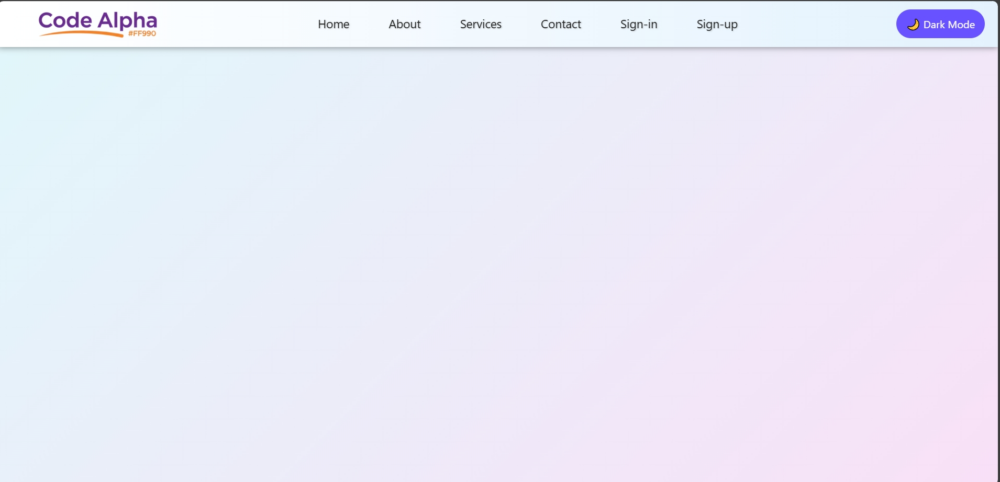

# 🌐 Responsive Navbar (JavaScript Day 3)
**Live Demo:**
👉 [Responsive Navbar](https://codealpha-responsive-navbar.vercel.app)

A modern and responsive **Navigation Bar** built completely using **pure JavaScript DOM manipulation** and **CSS styling**.  
Every part of the navbar — logo, menu links, sign-in/sign-up buttons, and even light/dark mode — is created dynamically without writing any HTML in the file.

---

## 🚀 Features
✅ Fully responsive for mobile, tablet, and desktop  
✅ Light ☀️ / Dark 🌙 theme toggle  
✅ Smooth hover animations with text shadows  
✅ Dynamic logo, links, and buttons — all generated with JavaScript  
✅ Flexbox-based layout for perfect alignment  
✅ Gradient backgrounds for both body and navbar  
✅ Animated hover effects on nav links and login buttons  
✅ 100% built using `document.createElement()` and `Object.assign()`  

---

## 🧱 Tech Stack & Architecture
- **Frontend:** JavaScript (ES6) + CSS (via inline JS styling)  
- **No frameworks or libraries used** — pure DOM manipulation  
- **Structure:**  
  - `div` for Navbar container  
  - `logo` section with background image  
  - `navlinks` created dynamically using an array  
  - `login` section with “Sign-in” and “Sign-up” buttons  

---

## 🧠 How It Works
1. The entire navbar is created dynamically using JavaScript (no static HTML).  
2. All styles are applied using `Object.assign()` inside the JS file.  
3. Hover events are managed with `mouseover` and `mouseout` listeners.  
4. The logo, links, and login text are inserted via arrays and loops.  
5. Text shadows, gradients, and transitions give it a smooth modern UI feel.  

---

## 💡 Learning Goals
This project helps you practice:
- DOM manipulation  
- Event handling in JavaScript  
- Responsive layout with Flexbox  
- Conditional styling  
- Dynamic element creation (`createElement`, `appendChild`)  
- Hover and animation effects with JS  

---

## 📸 Preview

---

## 🛠️ Developer Info
👨‍💻 **Developer:** Kabeer Hussain  
📘 **Series:** JavaScript — *30 Days, 30 Projects*  
📆 **Day:** 3 — *Responsive Navbar using JavaScript DOM*  
📧 **Email:** codealpha0786.com  
🔗 **GitHub:** [ITechKabeer](https://github.com/ITechKabeer)

Made by **Kabeer Hussain** ❤️

